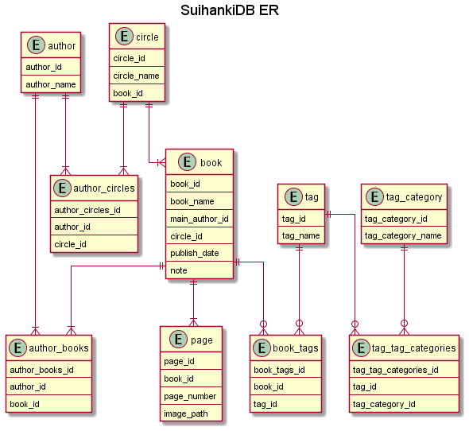

# Suihanki

Apache + Flask で動くNASのファイル管理アプリです。  

家にある紙の同人誌を自炊したデータを管理するデジタル書庫のようなものを実現することを目指します。

## ディレクトリ構成

```
.
├─uml
| └─機能を考えるための図置き場
├─LICENSE
└─README.md
```

## 今考えている機能

- DB  
  

- 外側から見える機能
  - タイトル一覧、著者一覧、etc.の取得
  - パラメータを指定しての「タイトル：ID」の一覧の取得  
    複数のタグや著者とタグの組み合わせなどの指定も可能
  - ID指定でデータダウンロード  
    （将来的には一時的にPDFにまとめてそれを返すみたいなのやりたい）
  - パラメータの指定を行いつつのデータアップロード  
  - IDを指定してパラメータの上書き

## ロードマップ

READMEにセットアップ手順をアップデートしながら

1. なんらかのRDBMSの読み書きでデータの取得・データの上書きをするPython側の機能開発（適当なライブラリありそう）
1. 想定している「本棚」のデータベース作成、少し具体化したPythonの機能開発
1. 上に書いた「外側から見える機能」のAPIを提供するPythonの機能開発
1. Apache + FlaskでWebサーバとしての機能開発

フロントエンドは気が向いたら作ります。